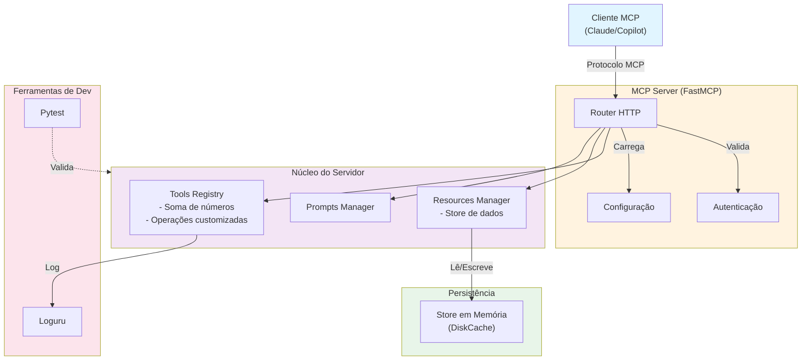
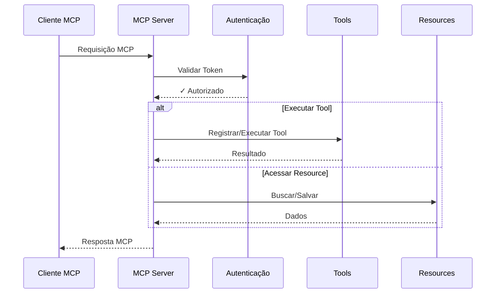
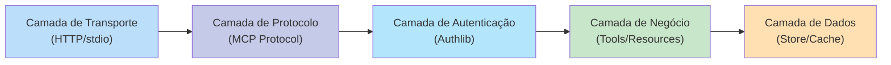

# Awesome Copilot - MCP Server

[](https://www.python.org/downloads/)
[](LICENSE)
[](https://github.com/jlopp/FastMCP)

Um servidor Model Context Protocol (MCP) robusto e escalável desenvolvido em Python, fornecendo ferramentas e recursos para integração com assistentes de IA como o GitHub Copilot.

## 📋 Conteúdo

- [Características](#características)
- [Arquitetura](#arquitetura)
- [Pré-requisitos](#pre-requisitos)
- [Instalação](#instalacao)
- [Uso](#uso)
- [Estrutura do Projeto](#estrutura-do-projeto)
- [Desenvolvimento](#desenvolvimento)
- [Testes](#testes)
- [Contribuindo](#contribuindo)
- [Licença](#licenca)

## ✨ Características

- **MCP Server com FastMCP**: Implementação moderna e assíncrona do protocolo MCP
- **Ferramentas Registráveis**: Sistema modular para registro de tools e resources
- **Gerenciamento de Configuração**: Suporte a variáveis de ambiente via `.env`
- **Logging Estruturado**: Logs robustos com Loguru para debugging e monitoramento
- **Suite de Testes**: Testes unitários abrangentes com pytest
- **Docker Support**: Containerização pronta para produção
- **Type Hints Completos**: Código totalmente tipado com MyPy

## 🏗️ Arquitetura

### Diagrama de Arquitetura



### Fluxo de Requisição



### Camadas da Aplicação



## 📦 Pre-requisitos {#pre-requisitos}

- **Python**: 3.11 ou superior
- **pip**: Gerenciador de pacotes Python
- **virtualenv**: Para isolamento de ambiente (recomendado)
- **Docker** (opcional): Para containerização

Verifique sua versão do Python:

```bash
python --version
```

## 🚀 Instalacao {#instalacao}

### 1. Clonar o Repositório

```bash
git clone https://github.com/seu-usuario/awesome-copilot.git
cd awesome-copilot
```

### 2. Criar Ambiente Virtual

```bash
python -m venv .venv
source .venv/bin/activate  # No Windows: .venv\Scripts\activate
```

### 3. Instalar Dependências

```bash
pip install -r requirements.txt
```

### 4. Configurar Variáveis de Ambiente

Crie um arquivo `.env` na raiz do projeto:

```bash
cp .env.example .env
```

Edite o arquivo `.env` com suas configurações:

```env
SERVER_NAME=awesome-copilot/mcp
VERSION=0.1.0
TRANSPORT=http
HOST=127.0.0.1
PORT=8000
API_KEY=sua-chave-api-aqui
```

## 💻 Uso

### Iniciar o Servidor em Desenvolvimento

```bash
python -m src.awesome_copilot.server
```

O servidor estará disponível em `http://127.0.0.1:8000`

**Saída esperada:**
```
INFO:mcp-server:Iniciando MCP Server...
INFO:mcp-server:Tools registradas: ['utils.add', 'store.set', 'store.get']
INFO:mcp-server:Server rodando em http://127.0.0.1:8000
```

### Usar com Docker

```bash
# Build da imagem
docker build -t awesome-copilot:latest .

# Executar container
docker run -p 8000:8000 -e API_KEY=sua-chave awesome-copilot:latest
```

### Chamar uma Tool

Exemplo com curl:

```bash
curl -X POST http://127.0.0.1:8000/call_tool \
  -H "Content-Type: application/json" \
  -d '{
    "name": "utils.add",
    "arguments": {"a": 5, "b": 3}
  }'
```

Resposta esperada:

```json
{
  "result": 8
}
```

### Armazenar e Recuperar Dados

```bash
# Armazenar
curl -X POST http://127.0.0.1:8000/call_tool \
  -H "Content-Type: application/json" \
  -d '{
    "name": "store.set",
    "arguments": {"key": "user_id", "value": "123"}
  }'

# Recuperar
curl -X POST http://127.0.0.1:8000/call_tool \
  -H "Content-Type: application/json" \
  -d '{
    "name": "store.get",
    "arguments": {"key": "user_id"}
  }'
```

## 📁 Estrutura do Projeto

```
awesome-copilot/
├── src/
│   └── awesome_copilot/
│       ├── __init__.py              # Inicializador do package
│       ├── server.py                # Entrypoint principal
│       ├── config.py                # Gerenciamento de configurações
│       ├── auth.py                  # Autenticação e autorização
│       ├── tools.py                 # Registro de tools
│       ├── resources.py             # Gerenciador de resources
│       ├── prompts.py               # Prompts pré-configurados
│       └── tests/
│           ├── test_tool.py         # Testes unitários de tools
│           └── test_resources.py    # Testes de resources
├── Dockerfile                       # Imagem Docker
├── pyproject.toml                   # Configuração Poetry
├── requirements.txt                 # Dependências pip
├── .env.example                     # Exemplo de variáveis de ambiente
├── README.md                        # Este arquivo
└── LICENSE                          # Licença MIT
```

### Descrição dos Módulos

| Módulo | Responsabilidade |
|--------|------------------|
| `server.py` | Inicialização e orquestração do servidor MCP |
| `config.py` | Carregamento de configurações via Pydantic |
| `auth.py` | Autenticação e validação de tokens |
| `tools.py` | Registro e implementação de ferramentas |
| `resources.py` | Gerenciamento de recursos persistentes |
| `prompts.py` | Templates de prompts para IA |

## 🛠️ Desenvolvimento

### Configurar Ambiente de Desenvolvimento

```bash
# Ativar virtual env
source .venv/bin/activate

# Instalar com dependências de dev
pip install -r requirements.txt

# Instalar pre-commit hooks (opcional)
pip install pre-commit
pre-commit install
```

### Estrutura de Código

O projeto segue as melhores práticas Python:

- **Type Hints**: Todos os arquivos usam type hints
- **Docstrings**: Funções documentadas com docstrings
- **Async/Await**: Código assíncrono com asyncio
- **Pydantic Models**: Validação de dados com Pydantic
- **Environment Variables**: Suporte a `.env` com Pydantic Settings

### Adicionar uma Nova Tool

1. Defina um modelo Pydantic para os argumentos:

```python
# Em tools.py
from pydantic import BaseModel

class MultiplyArgs(BaseModel):
    a: float
    b: float
```

1. Registre a tool no servidor:

```python
def register_tools(mcp: FastMCP):
    @mcp.tool(
        name="utils.multiply",
        description="Multiplica dois números"
    )
    async def multiply_tool(args: MultiplyArgs) -> Dict[str, Any]:
        return {"result": args.a * args.b}
```

1. Teste a nova tool (veja seção Testes)

### Adicionar um Novo Resource

```python
# Em resources.py
def get_resources():
    return {
        "store": Store(),
        "meu_novo_resource": MeuNovoResource()
    }
```

## 🧪 Testes

### Executar Todos os Testes

```bash
pytest -v
```

### Executar com Cobertura

```bash
pytest --cov=src/awesome_copilot --cov-report=html
```

### Executar um Teste Específico

```bash
pytest src/awesome_copilot/tests/test_tool.py::test_add_tool -v
```

### Exemplo de Teste

```python
# Em tests/test_tool.py
import pytest
from awesome_copilot.tools import SumArgs

@pytest.mark.asyncio
async def test_add_tool():
    args = SumArgs(a=5, b=3)
    result = await add_tool(args)
    assert result["result"] == 8
```

### Coverage Mínimo

Manter pelo menos **80% de cobertura de código**:

```bash
pytest --cov=src/awesome_copilot --cov-fail-under=80
```

## 📚 Dependências Principais

| Pacote | Versão | Propósito |
|--------|--------|-----------|
| `fastmcp` | 2.13.1 | SDK para implementar MCP servers |
| `fastapi` | 0.121.2 | Framework web assíncrono |
| `pydantic` | v2 | Validação de dados e settings |
| `loguru` | 0.7.3 | Logging estruturado e robusto |
| `pytest` | latest | Framework de testes |
| `authlib` | 1.6.5 | Autenticação e segurança |

Para instalar apenas dependências de produção:

```bash
pip install -r requirements.txt
```

Para instalar com ferramentas de dev (mypy, ruff, etc):

```bash
pip install -r requirements.txt --dev
```

## 🔒 Segurança

- **API Keys**: Sempre use variáveis de ambiente (nunca commit no repositório)
- **HTTPS em Produção**: Configure certificados SSL/TLS
- **Validação de Input**: Todas as inputs são validadas com Pydantic
- **CORS**: Configure CORS adequadamente para seu ambiente
- **Rate Limiting**: Implemente rate limiting em produção

### Checklist de Segurança

- [ ] Nunca faça commit de `.env` - use `.env.example`
- [ ] Use secrets gerenciados (AWS Secrets, Vault, etc)
- [ ] Valide todos os inputs com Pydantic
- [ ] Implemente autenticação robusta
- [ ] Configure HTTPS em produção
- [ ] Implemente rate limiting
- [ ] Use variáveis de ambiente para configurações sensíveis

## 🚢 Deploy

### Deployment em Produção

```bash
# Build da imagem Docker
docker build -t awesome-copilot:v0.1.0 .

# Push para registro (ex: Docker Hub)
docker push seu-usuario/awesome-copilot:v0.1.0

# Deploy com Docker Compose
docker-compose up -d
```

### Variáveis de Produção

```env
SERVER_NAME=awesome-copilot/mcp
VERSION=0.1.0
TRANSPORT=http
HOST=0.0.0.0
PORT=8000
API_KEY=sua-chave-produção-segura
DEBUG=false
LOG_LEVEL=INFO
```

## 📋 Troubleshooting

### Erro: "ModuleNotFoundError: No module named 'src'"

```bash
# Instale o pacote em modo desenvolvimento
pip install -e .
```

### Servidor não inicia

1. Verifique se a porta 8000 está disponível
2. Verifique variáveis de ambiente em `.env`
3. Verifique logs: `python -m src.awesome_copilot.server --debug`

### Teste falha

```bash
# Execute com verbosidade
pytest -vv --tb=short

# Execute apenas testes específicos
pytest -k "test_add" -v
```

### Problema de dependências

```bash
# Limpe cache pip
pip cache purge

# Reinstale dependências
pip install --upgrade --force-reinstall -r requirements.txt
```

## 📖 Recursos Adicionais

- [MCP Specification](https://modelcontextprotocol.io/)
- [FastMCP Documentation](https://github.com/jlopp/FastMCP)
- [FastAPI Documentation](https://fastapi.tiangolo.com/)
- [Pydantic Documentation](https://docs.pydantic.dev/)
- [Python AsyncIO Guide](https://docs.python.org/3/library/asyncio.html)

## 🤝 Contribuindo

As contribuições são bem-vindas! Por favor:

1. Fork o projeto
2. Crie uma branch para sua feature (`git checkout -b feature/AmazingFeature`)
3. Commit suas mudanças (`git commit -m 'Add AmazingFeature'`)
4. Push para a branch (`git push origin feature/AmazingFeature`)
5. Abra um Pull Request

### Diretrizes de Contribuição

- Siga o estilo de código do projeto (use `ruff` para linting)
- Escreva testes para novas features
- Mantenha cobertura de testes acima de 80%
- Atualize a documentação conforme necessário
- Use type hints em todo o código

## 📝 Changelog

### v0.1.0 (2025-11-16)

- ✨ Implementação inicial do MCP Server
- 🔧 Suporte a tools customizáveis
- 💾 Sistema de store para persistência
- 🧪 Suite de testes com pytest
- 🐳 Dockerfile para containerização
- 📚 Documentação completa

## 📄 Licenca {#licenca}

Este projeto está licenciado sob a Licença MIT - veja o arquivo [LICENSE](LICENSE) para detalhes.

## 👥 Autores

- **Darp** - *Trabalho Inicial*

## 💬 Suporte

Para suporte, abra uma [issue no GitHub](https://github.com/seu-usuario/awesome-copilot/issues) ou entre em contato através do email.

---

**Feito com ❤️ por DARP**

